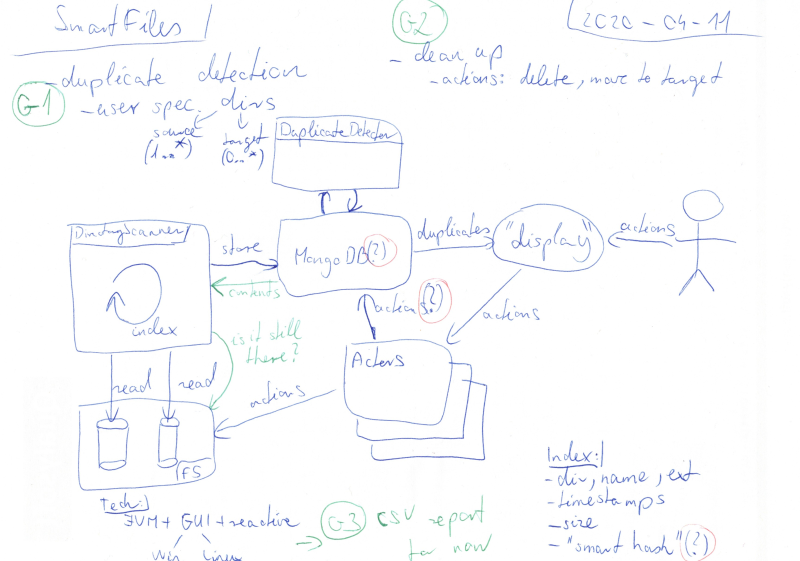

# SmartFiles - Idea

SmartFiles - a file management toolkit.

## Sketch

The idea is to develop an application which is able to carry out "magical" 
file management actions. The first iteration shall cover a personal use-case 
of efficiently detecting, displaying and cleaning up duplicate files.

## Goals

Goals for the first iteration.

### Duplicate detection

Detect duplicate files. This can be done by comparing names, sizes and timestamps. 
A smart hashing algorithm could be used as well if the traditional hashing 
algorithms perform slowly for large files.

### Clean up

Clean up duplicate files by either removing them or moving them to a target directory. 
Clean up should be able to move deleted files to a back up directory instead of 
permanently deleting them.

### Visualisation

For the first iteration, KISS and create CSV reports. Later a nice UI could be 
developed.

## Technology

Business logic:

 * Java
 * Spring
 * Reactive

Data:

 * MongoDB

Display:

 * CSV (first display iteration)
 * Web interface (second display iteration)
   * TypeScript
   * Angular/Vue/React (to be decided later)
 * Electron (third display iteration)

Development:
 * Gradle
 * Travis CI
 * Sonar
 * Kanban integration with GitHub issues
